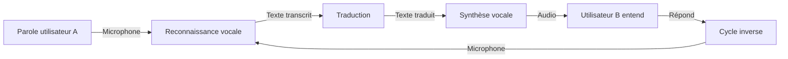

[](https://github.com/nabz0r/mac-local-translator/actions)
[](https://opensource.org/licenses/MIT)
[](https://swift.org)
[](https://www.apple.com/macos/)

> **Traduction conversationnelle en temps réel, entièrement hors-ligne et respectueuse de la vie privée** 🔒

<p align="center">
  <a href="https://www.buymeacoffee.com/nabz0r"></a>
</p>

## 🌟 Caractéristiques principales

- **Entièrement local** : Aucune connexion internet requise 📶
- **Privé & Sécurisé** : Vos conversations ne quittent jamais votre appareil 🔐
- **Bidirectionnel** : Traduction naturelle entre deux interlocuteurs 👥
- **Performant** : Modèles optimisés pour les Mac Intel et Apple Silicon ⚡
- **Intuitif** : Interface élégante centrée sur la conversation 💬

## 🔍 Aperçu

Mac Local Translator permet de traduire des conversations en temps réel sans dépendre de services cloud. L'application utilise des modèles locaux avancés pour la reconnaissance vocale et la traduction, garantissant votre confidentialité tout en offrant des performances excellentes.



## 🚀 Installation rapide

### Prérequis
- macOS 12.0 ou plus récent
- 8 GB RAM minimum (16 GB recommandés)
- 5 GB d'espace disque disponible

### Méthode 1: Installation depuis le DMG
1. Téléchargez la dernière version depuis la [page des releases](https://github.com/nabz0r/mac-local-translator/releases)
2. Montez le fichier DMG et glissez l'application dans votre dossier Applications
3. Lancez l'application

### Méthode 2: Compilation depuis les sources

```bash
# Cloner le dépôt
git clone https://github.com/nabz0r/mac-local-translator.git
cd mac-local-translator

# Installer les dépendances et télécharger les modèles
make download-models

# Compiler l'application
make build

# Lancer l'application
make run
```

## 🏛️ Architecture

L'application est construite sur une architecture modulaire pour une maintenance et une extension faciles.

```mermaid
flowchart TD
    subgraph Interface
        A[\"ContentView\"] --> B[\"ConversationView\"]
        A --> C[\"ToolbarView\"]
        A --> D[\"ControlPanelView\"]
    end
    
    subgraph Services
        E[\"AudioRecordingService\"] --> I[\"TranslationCoordinator\"]
        F[\"SpeechRecognitionService\"] --> I
        G[\"TranslationService\"] --> I
        H[\"SpeechSynthesisService\"] --> I
    end
    
    subgraph Modèles
        J[\"AppState\"] --> I
        K[\"ModelManager\"] --> I
        L[\"PreferencesManager\"] --> I
    end
    
    I --> A
```

## 🎯 Guide d'utilisation

1. **Sélection des langues** : Choisissez les langues source et cible dans la barre d'outils
2. **Démarrage** : Appuyez sur le bouton d'enregistrement ou utilisez Cmd+Espace
3. **Parlez** : Parlez clairement dans votre microphone (l'indicateur de niveau audio vous aidera)
4. **Écoutez** : La traduction sera affichée et prononcée automatiquement
5. **Réponse** : Votre interlocuteur peut répondre dans sa langue et le cycle continue

## 🛠️ Technologies utilisées

- **Interface utilisateur** : SwiftUI
- **Reconnaissance vocale** : Whisper.cpp (version optimisée de OpenAI Whisper)
- **Traduction** : Modèles LibreTranslate/Argos Translate optimisés
- **Synthèse vocale** : AVSpeechSynthesizer avec des voix de qualité

## 🗣️ Langues supportées

- 🇫🇷 Français
- 🇬🇧 Anglais
- 🇪🇸 Espagnol
- 🇩🇪 Allemand
- 🇮🇹 Italien
- 🇵🇹 Portugais

D'autres langues sont en cours de développement. Consultez la [feuille de route](ROADMAP.md) pour plus d'informations.

## 👥 Contribution

Les contributions sont les bienvenues ! Consultez notre [guide de contribution](CONTRIBUTING.md) pour commencer.


## 🤝 Contribution

We welcome:

- 💻 Network Engineers
- 👀 Research Scientists
- 🌎 Cloud Architects
- 🤖 AI/ML Specialists

## 📱 Contact

- 📧 Email: nabz0r@gmail.com
- 🐙 GitHub: [@nabz0r](https://github.com/nabz0r)

## 📄 License

[MIT License](LICENSE) - Innovation without Boundaries

## 🙏 Remerciements

- [OpenAI Whisper](https://github.com/openai/whisper) pour le modèle de reconnaissance vocale
- [LibreTranslate](https://github.com/LibreTranslate/LibreTranslate) pour les modèles de traduction
- Tous les contributeurs qui ont rendu ce projet possible
