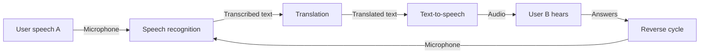

[](https://github.com/nabz0r/mac-local-translator/actions)
[](https://opensource.org/licenses/MIT)
[](https://swift.org)
[](https://www.apple.com/macos/)

> **Real-time, fully offline, privacy-friendly conversational translation** 🔒

<p align="center">
 <a href="https://www.buymeacoffee.com/nabz0r"></a>
</p>

## 🌟 Key Features

- **Fully local**: No internet connection required 📶
- **Private & Secure**: Your conversations never leave your device 🔐
- **Bidirectional**: Natural translation between two speakers 👥
- **Powerful**: Models optimized for Intel and Apple Silicon Macs ⚡
- **Intuitive**: Elegant, conversation-centric interface 💬

## 🔍 Overview

Mac Local Translator allows you to translate conversations in real-time without relying on cloud services. The app uses advanced local models for speech recognition and translation, ensuring your privacy while delivering excellent performance.



## 🚀 Quick Install

### Requirements
- macOS 12.0 or newer
- 8 GB RAM minimum (16 GB recommended)
- 5 GB of available disk space

### Method 1: Install from DMG
1. Download the latest version from the [releases page](https://github.com/nabz0r/mac-local-translator/releases)
2. Mount the DMG file and drag the application into your Applications folder
3. Launch the application

### Method 2: Build from source

```bash
# Clone the repository
git clone https://github.com/nabz0r/mac-local-translator.git
cd mac-local-translator

# Install dependencies and download models
make download-models

# Build the application
make build

# Launch the application
make run
```

## 🏛️ Architecture

The application is built on a modular architecture for easy maintenance and extension.

[releasesarchitecture_overviewpage](https://github.com/nabz0r/mac-local-translator/docs/architecture_overview.md)

## 🎯 User Guide

1. **Language Selection**: Choose the source and target languages ​​in the bar tools
2. **Start**: Press the record button or use Cmd+Space
3. **Speak**: Speak clearly into your microphone (the audio level indicator will help you)
4. **Listen**: The translation will be displayed and pronounced automatically
5. **Reply**: Your interlocutor can respond in their language and the cycle continues

## 🛠️ Technologies used

- **User interface**: SwiftUI
- **Speech recognition**: Whisper.cpp (optimized version of OpenAI Whisper)
- **Translation**: Optimized LibreTranslate/Argos Translate models
- **Text-to-speech**: AVSpeechSynthesizer with quality voices

## 🗣️ Supported languages

- 🇫🇷 French
- 🇬🇧 English
- 🇪🇸 Spanish
- 🇩🇪 German
- 🇮🇹 Italian
- 🇵🇹 Portuguese

More languages ​​are under development. Check out the [roadmap](ROADMAP.md) for more information.

## 🤝 Contribution

We welcome:

- 💻 Network Engineers
- 👀 Research Scientists
- 🌎 Cloud Architects
- 🤖 AI/ML Specialists

## 📱 Contact

- 📧 Email: nabz0r@gmail.com
- 🐙 GitHub: [@nabz0r](https://github.com/nabz0r)

## 📄 License

[MIT License](LICENSE) - Innovation without Boundaries

## 🙏 Thanks

- [OpenAI Whisper](https://github.com/openai/whisper) for the speech recognition model
- [LibreTranslate](https://github.com/LibreTranslate/LibreTranslate) for the translation models
