# 🏗️ Architecture Technique de Mac Local Translator

Ce document présente l'architecture technique complète de Mac Local Translator à travers des diagrammes visuels et des explications détaillées.

## 🖼️ Vue d'ensemble

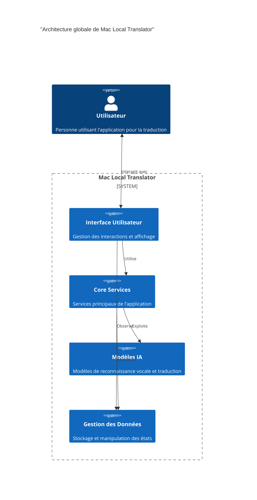

## 🔢 Décomposition des composants

### 1. Interface Utilisateur (SwiftUI)

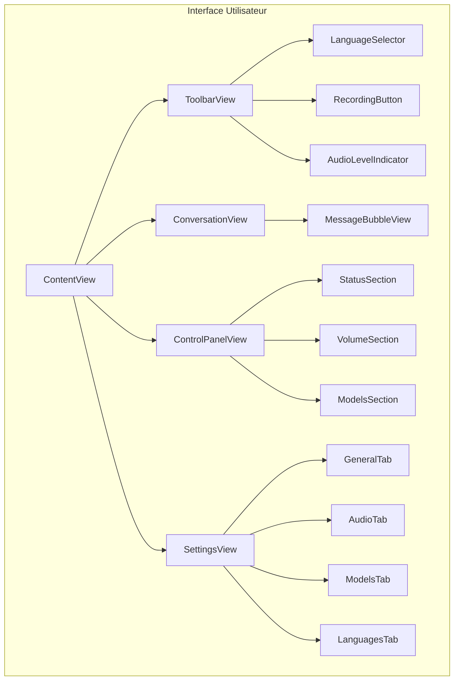

### 2. Flux de données et signaux

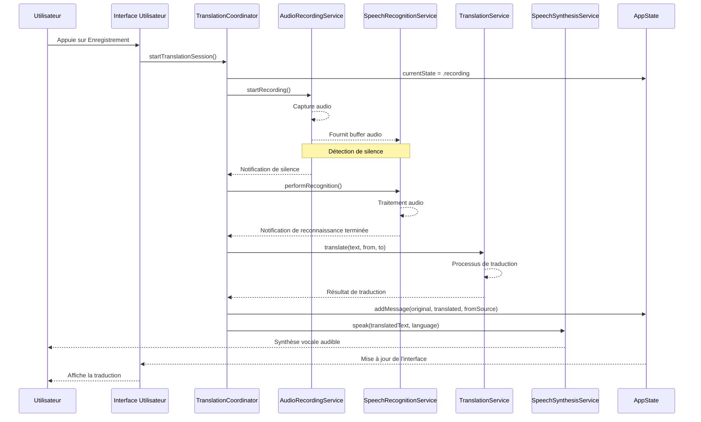

### 3. Structure des services

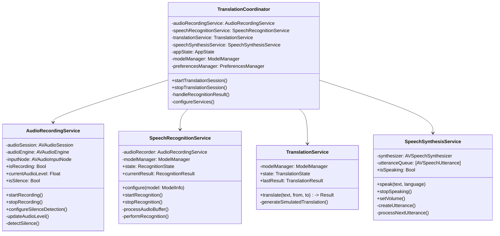

### 4. Gestion des états et données

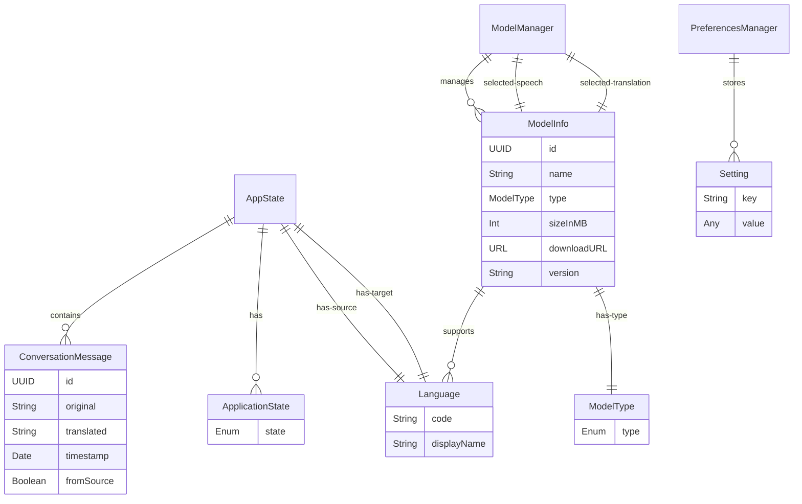

## 📍 Processus clés

### 1. Traitement audio et reconnaissance vocale

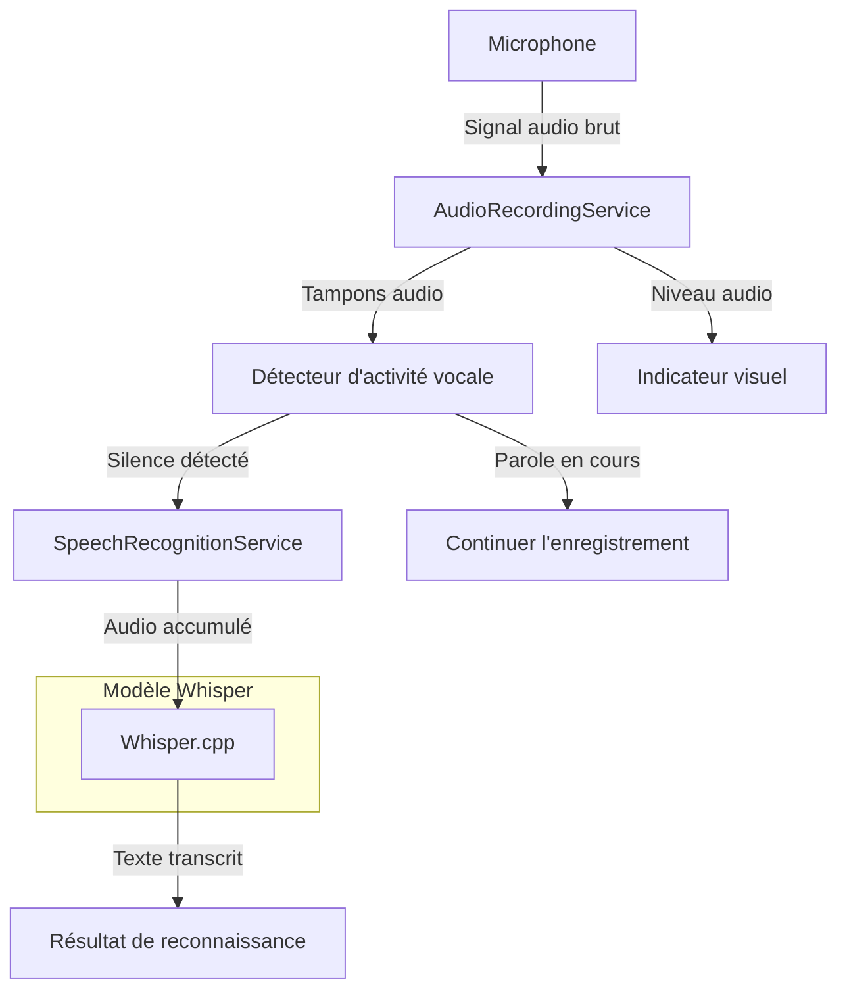

### 2. Traduction et synthèse vocale

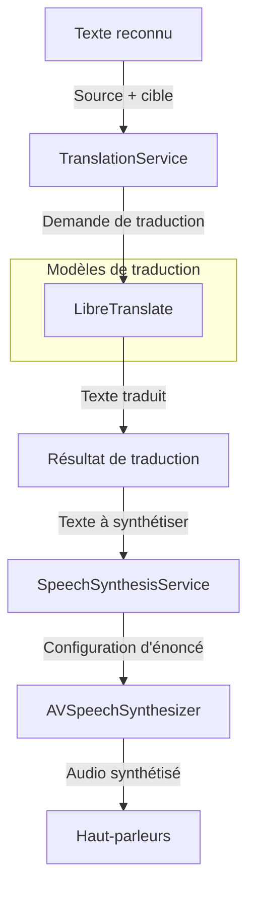

### 3. Cycle de vie des données

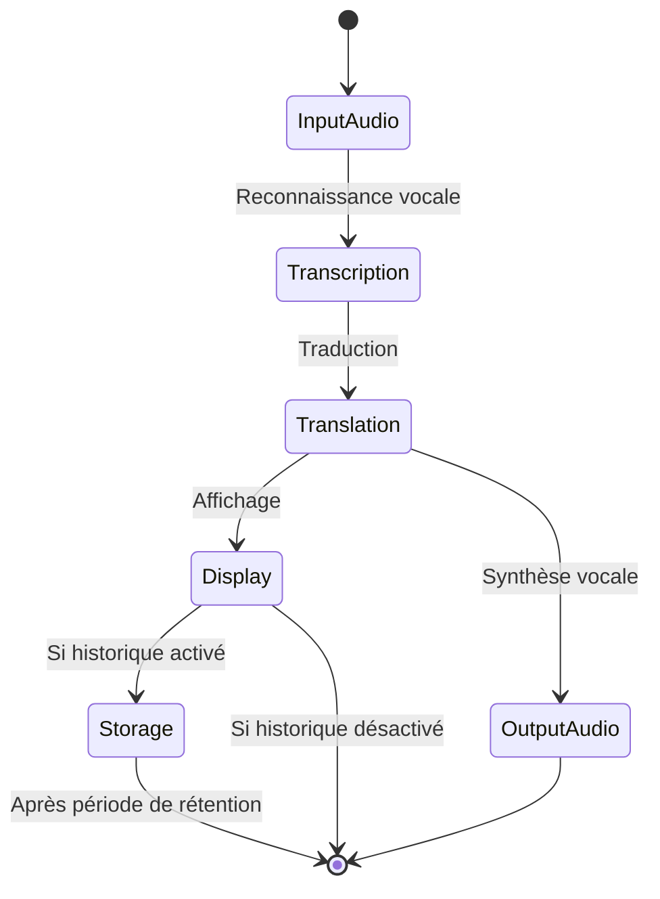

## 💯 Gestion des performances

### 1. Utilisation de la mémoire

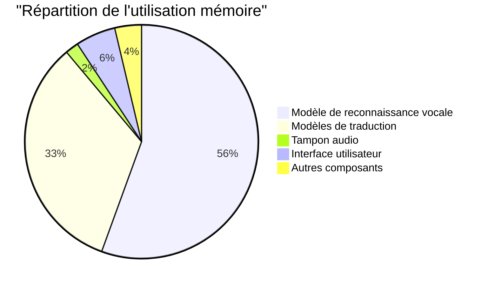

### 2. Stratégie d'optimisation

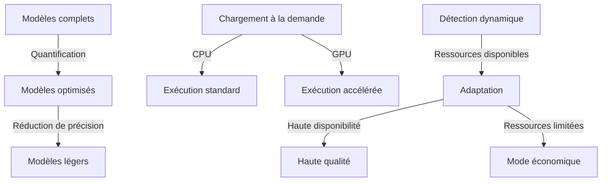

## 🔒 Sécurité et confidentialité

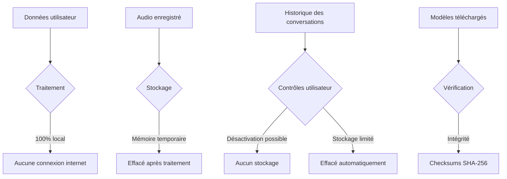

## 📦 Structure des packages et dépendances

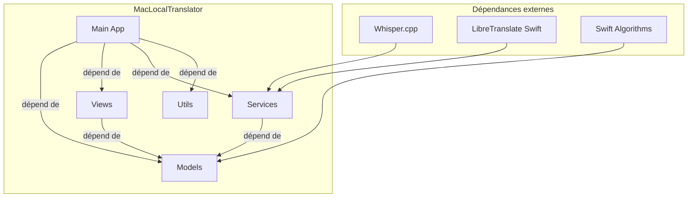

## 📄 Modèles de fichiers et stockage

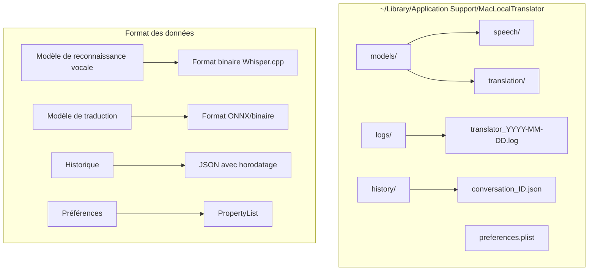

## 📊 Métriques et surveillance

```mermaid
dashboard
    title "Tableau de bord de performances"
    
    graph CPU "Utilisation CPU"
        title "Utilisation CPU par composant"
        x-axis "Temps (s)"
        y-axis "% CPU"
        bar "Reconnaissance"
        bar "Traduction"
        bar "Interface"
        bar "Audio"
    
    graph Memory "Utilisation mémoire"
        title "Consommation de RAM"
        x-axis "Temps (s)"
        y-axis "Mo"
        line "Total"
        line "Modèles"
        line "Données"
        line "Cache"
    
    graph Response "Temps de réponse"
        title "Latence par étape (ms)"
        x-axis "Composant"
        y-axis "Temps (ms)"
        bar "VAD"
        bar "Reconnaissance"
        bar "Traduction"
        bar "Synthèse"
```

## 🛠️ Évolution et extensibilité

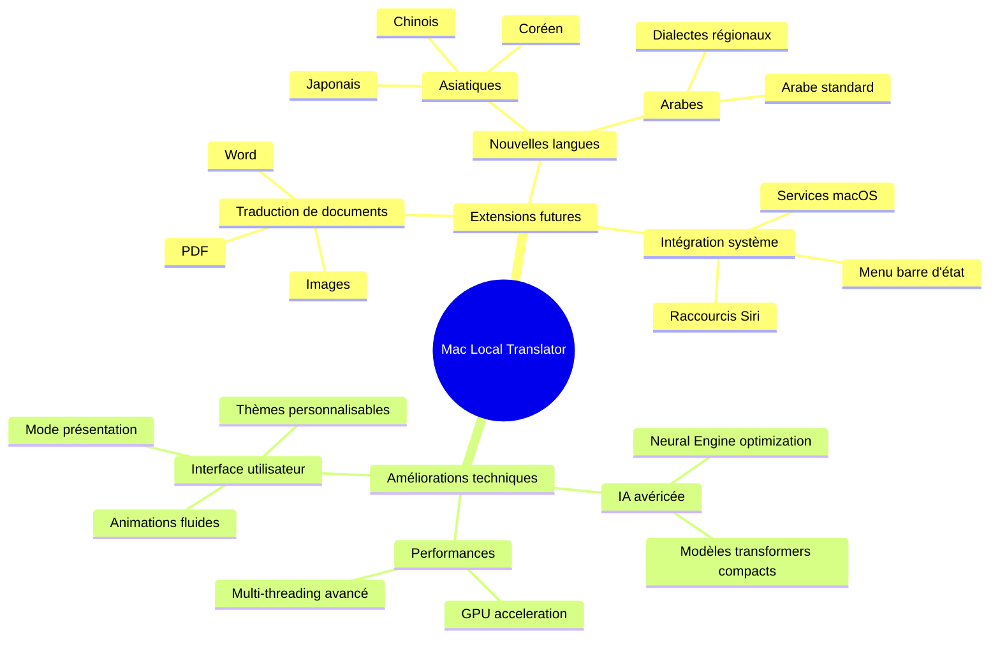

---

<p align="center">
  <b>Vue d'ensemble technique de Mac Local Translator</b><br>
  Ce document s'adresse aux développeurs et architectes travaillant sur le projet
</p>