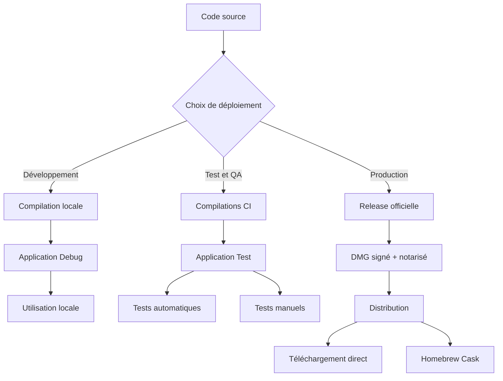
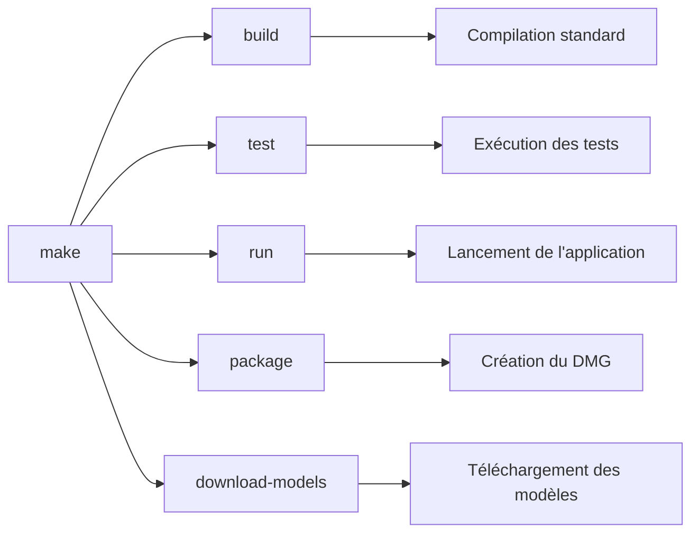
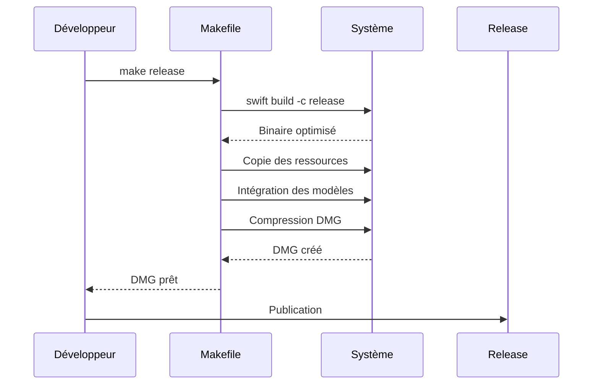
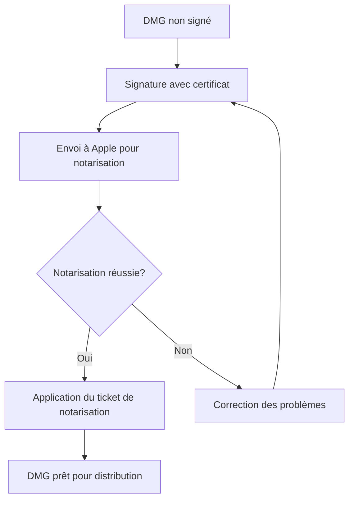
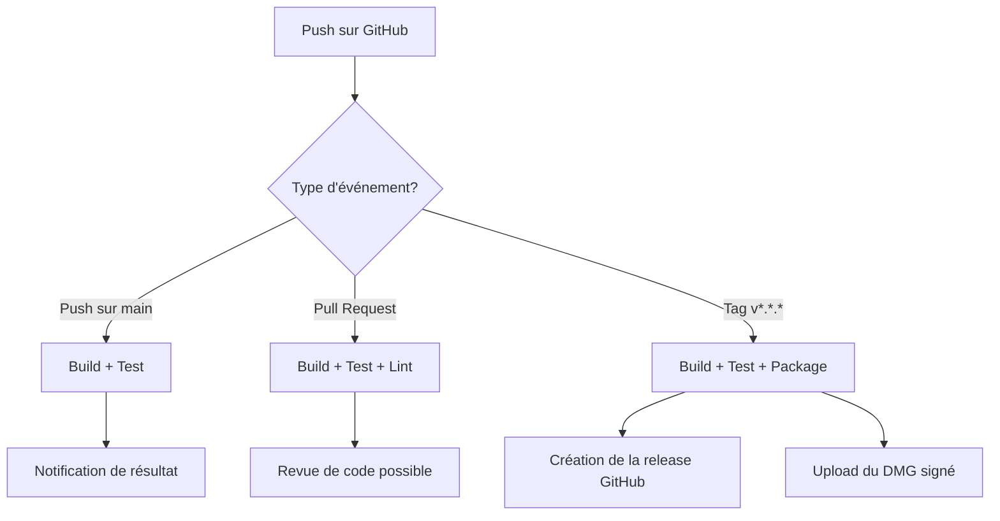
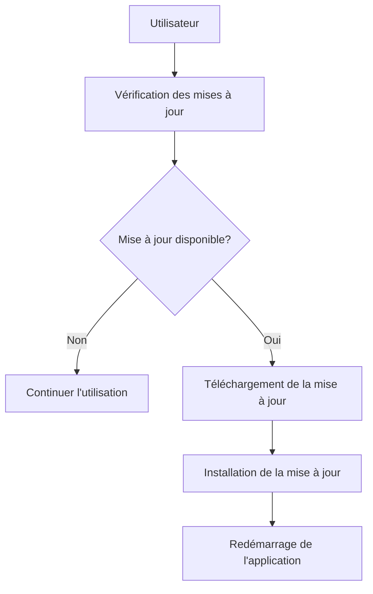

# 🚀 Guide de déploiement de Mac Local Translator

Ce guide vous aidera à déployer Mac Local Translator dans différents environnements, de la compilation depuis les sources jusqu'à la distribution aux utilisateurs finaux.

## 💻 Flux de déploiement



## 🐸 Prérequis

### Pour le développement

- macOS 12.0 ou supérieur
- Xcode 14.0 ou supérieur
- Swift 5.7 ou supérieur
- Git

### Pour la distribution

- Compte développeur Apple (pour la signature et la notarisation)
- Certificats de signature valides

## 👷 Déploiement pour le développement

### 1. Préparation de l'environnement

```bash
# Clone du dépôt
git clone https://github.com/nabz0r/mac-local-translator.git
cd mac-local-translator

# Installation des outils nécessaires (si besoin)
brew install swiftlint
pip install jazzy  # Pour la génération de documentation
```

### 2. Structure des tâches Makefile



### 3. Compilation et exécution

```bash
# Télécharger les modèles nécessaires
make download-models

# Compiler l'application
make build

# Exécuter les tests
make test

# Lancer l'application
make run
```

## 📦 Création d'un package de distribution

### 1. Flux de creation du DMG



### 2. Commandes pour la création du package

```bash
# Compiler en mode release
make release

# Créer le package DMG
make package
```

Le package DMG sera créé dans le dossier `.build/` et contiendra :
- L'application compilée
- Les modèles nécessaires
- Les ressources et la documentation

## 🔒 Signature et notarisation (pour distribution publique)



### Procédure de signature

```bash
# Signature de l'application
codesign --force --options runtime --sign "Developer ID Application: Votre Nom (TEAMID)" .build/release/MacLocalTranslator.app

# Création du DMG signé
hdiutil create -volname "Mac Local Translator" -srcfolder .build/dmg -ov -format UDZO .build/MacLocalTranslator_signed.dmg

# Signature du DMG
codesign --force --sign "Developer ID Application: Votre Nom (TEAMID)" .build/MacLocalTranslator_signed.dmg

# Notarisation
xcrun altool --notarize-app --primary-bundle-id "com.example.maclocaltranslator" --username "apple@email.com" --password "app-specific-password" --file .build/MacLocalTranslator_signed.dmg

# Vérification du statut de notarisation
xcrun altool --notarization-info [REQUEST_UUID] -u "apple@email.com" -p "app-specific-password"

# Application du ticket de notarisation
xcrun stapler staple .build/MacLocalTranslator_signed.dmg
```

## 💾 Intégration continue (CI)

### Workflow GitHub Actions



Le processus CI est déjà configuré dans le fichier `.github/workflows/ci.yml` et s'exécute automatiquement :

1. À chaque push sur la branche principale (tests de base)
2. À chaque Pull Request (tests complets et linting)
3. À chaque création de tag (build, tests, packaging et release)

## 📶 Distribution

### 1. Release GitHub

Après la création d'un tag, le workflow CI crée automatiquement une release GitHub avec :

- Le DMG signé et notarisé
- Les notes de release (générées depuis les commits)
- La documentation mise à jour

### 2. Homebrew Cask (optionnel)

Pour permettre l'installation via Homebrew :

```ruby
# maclocaltranslator.rb
cask "maclocaltranslator" do
  version "1.0.0"
  sha256 "sha256_du_dmg"
  
  url "https://github.com/nabz0r/mac-local-translator/releases/download/v#{version}/MacLocalTranslator-#{version}.dmg"
  name "Mac Local Translator"
  desc "Application de traduction locale pour Mac"
  homepage "https://github.com/nabz0r/mac-local-translator"
  
  app "Mac Local Translator.app"
  
  zap trash: [
    "~/Library/Application Support/MacLocalTranslator",
    "~/Library/Caches/com.example.maclocaltranslator",
    "~/Library/Preferences/com.example.maclocaltranslator.plist"
  ]
end
```

## 🔁 Mise à jour de l'application



Pour implémenter un système de mise à jour :

1. Ajoutez un endpoint pour vérifier la dernière version (`https://api.github.com/repos/nabz0r/mac-local-translator/releases/latest`)
2. Comparez la version avec la version actuelle de l'application
3. Proposez le téléchargement si une nouvelle version est disponible

## 💡 Conseils et bonnes pratiques

- **Toujours tester localement** avant de créer un tag de release
- **Suivre le versionnement sémantique** (MAJOR.MINOR.PATCH)
- **Documenter chaque changement** dans les notes de release
- **Vérifier les dépendances** pour éviter les problèmes de compatibilité
- **Maintenir à jour les modèles** avec le script `download_models.sh`

## 🌐 Déploiement dans différentes régions

L'application est conçue pour fonctionner avec plusieurs langues. Lors du déploiement global, assurez-vous de :

1. Inclure les modèles pour toutes les langues supportées
2. Localiser l'interface utilisateur
3. Adapter les ressources vocales pour chaque région

---

<p align="center">
  Pour toute question sur le déploiement, veuillez ouvrir une issue sur le <a href="https://github.com/nabz0r/mac-local-translator/issues">tracker GitHub</a>.
</p>