# 🔨 Guide des tâches de développement

Ce document présente les différentes tâches de développement pour Mac Local Translator, avec des workflows visuels et des instructions détaillées.

## 📈 Vue d'ensemble des modules et dépendances

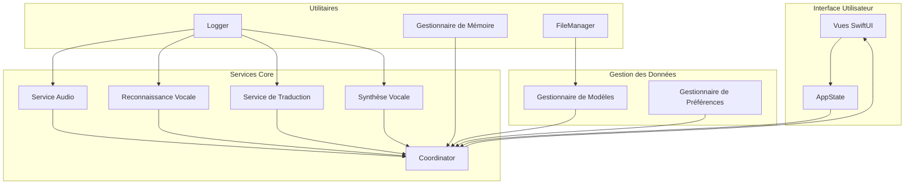

## ⏱️ Workflows de développement

### Cycle d'implémentation de fonctionnalité

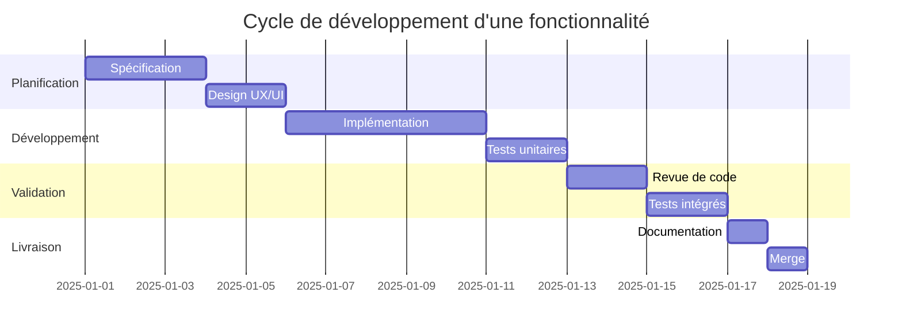

## 📌 Tâches par domaine

### 1. Interface utilisateur

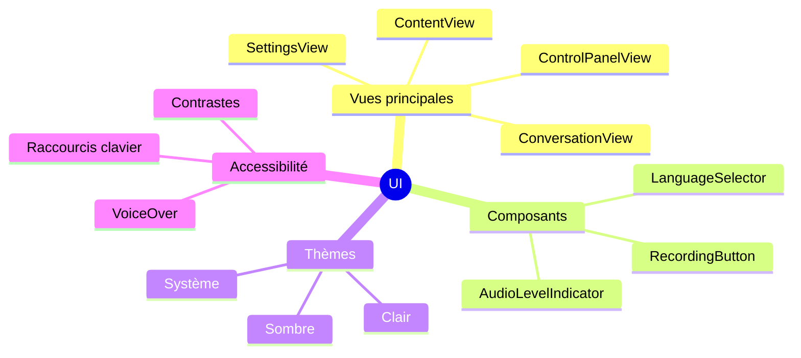

#### Instructions de développement UI

Pour ajouter une nouvelle vue :

1. Créer un fichier dans `Sources/MacLocalTranslator/Views/`
2. Utiliser le modèle de base SwiftUI avec prévisualisation
3. Injecter les dépendances nécessaires via `@EnvironmentObject`
4. Implémenter les tests dans `Tests/MacLocalTranslatorTests/Views/`

### 2. Services principaux

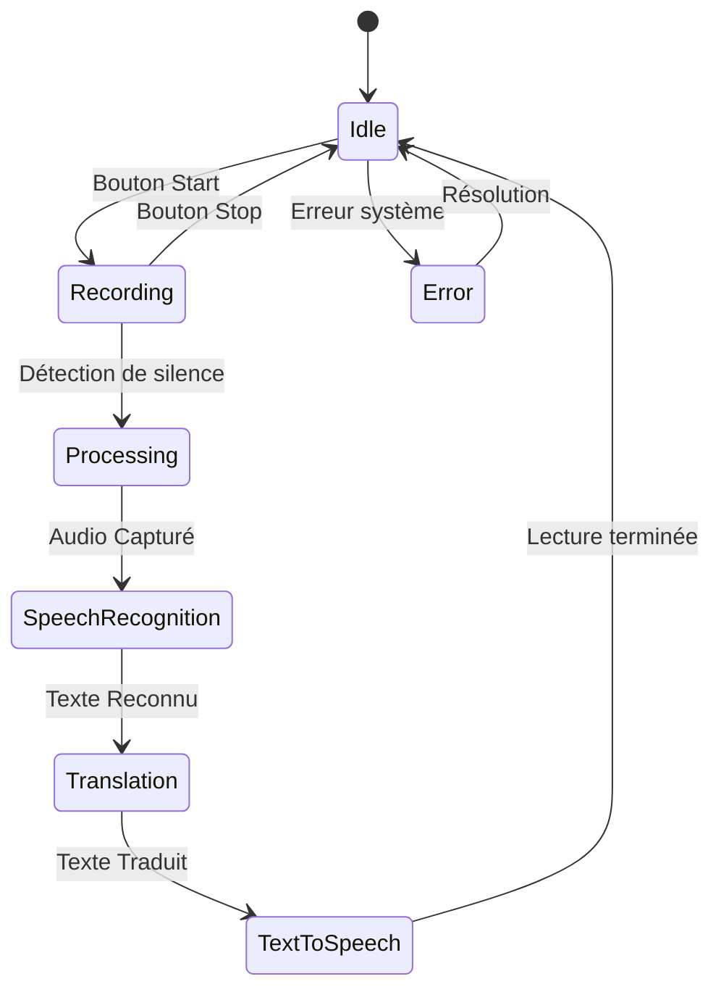

#### Implémentation d'un nouveau service

1. Créer une classe dans `Sources/MacLocalTranslator/Services/`
2. Implémenter l'interface et les méthodes requises
3. Ajouter la journalisation pour le débogage
4. Intégrer le service dans `TranslationCoordinator`
5. Écrire les tests dans `Tests/MacLocalTranslatorTests/Services/`

### 3. Gestion des modèles

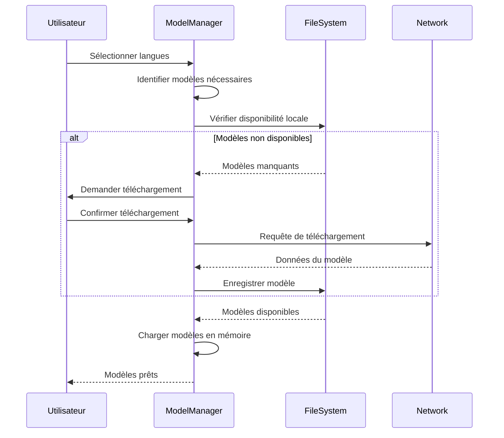

#### Ajout de nouveaux modèles de langue

1. Mettre à jour `download_models.sh` avec les URLs des nouveaux modèles
2. Ajouter la nouvelle langue dans l'énumération `Language` 
3. Implémenter le support dans `TranslationService`
4. Mettre à jour les interfaces utilisateur pour inclure la nouvelle langue

### 4. Optimisation des performances

```mermaid
quadrantChart
    title "Priorités d'optimisation"
    x-axis "Impact" "Faible" --> "Élevé"
    y-axis "Effort" "Élevé" --> "Faible"
    
    quadrant-1 "Priorité haute"
    quadrant-2 "Quick wins"
    quadrant-3 "À éviter"
    quadrant-4 "Envisageable"
    
    "Optimisation des modèles": [0.9, 0.4]
    "Quantification des poids": [0.8, 0.6]
    "Parallélisation": [0.7, 0.3]
    "Mise en cache": [0.5, 0.8]
    "GPU Acceleration": [0.9, 0.2]
    "Réduction de la précision": [0.3, 0.7]
```

## 💼 Processus de travail pour les développeurs

### Structure des branches Git

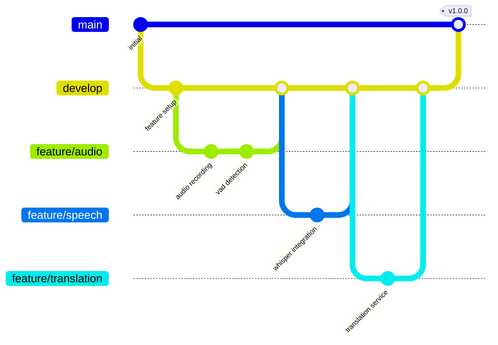

### Standup et suivi des tâches

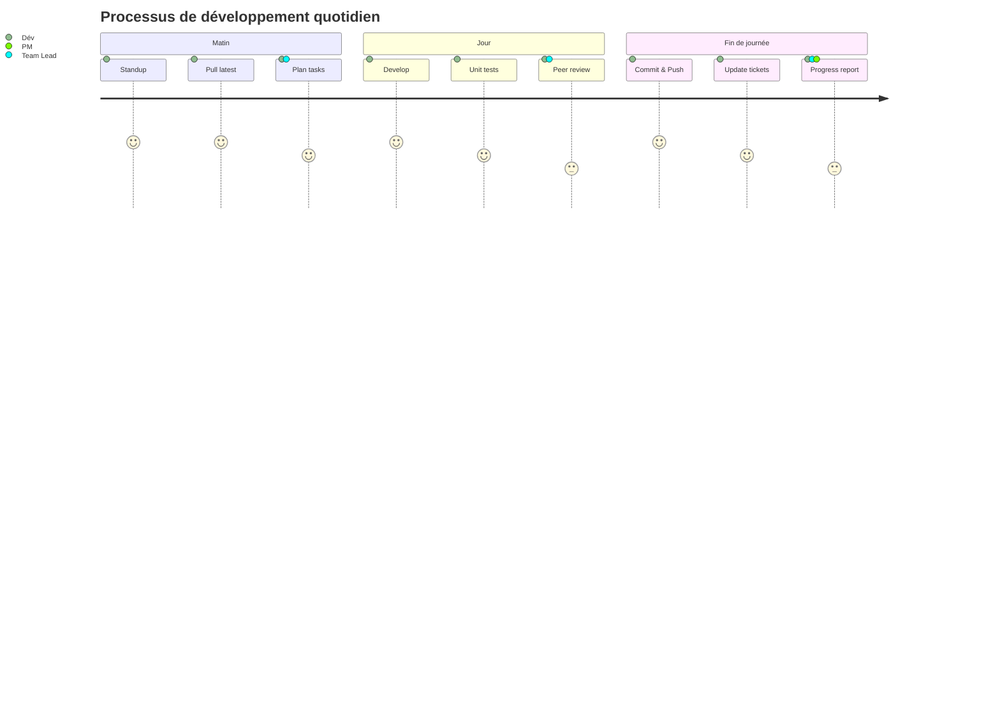

## 📃 Testing et qualité

### Matrice de couverture de tests

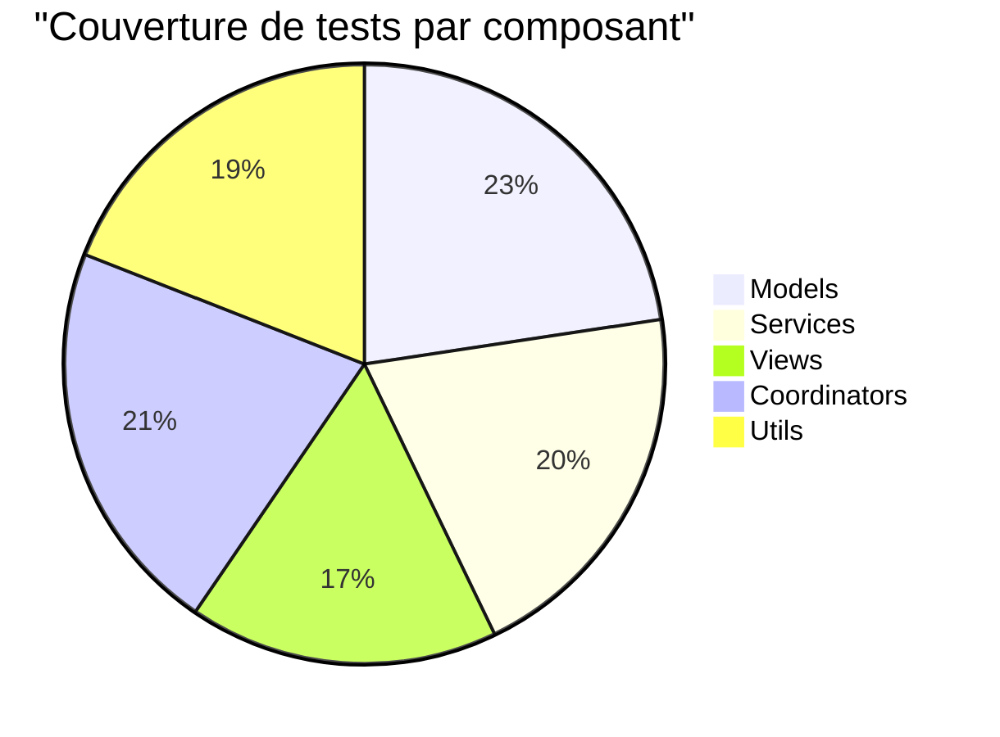

### Pipeline de qualité

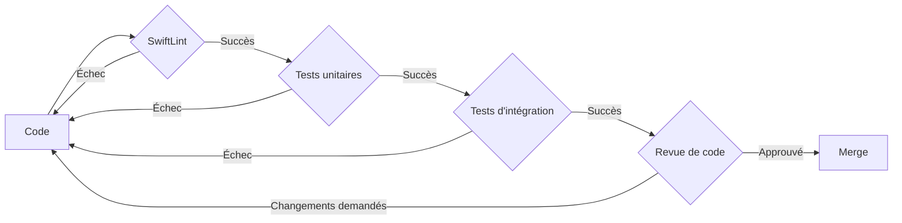

## 💪 Bonnes pratiques

### Pour l'accessibilité et la localisation

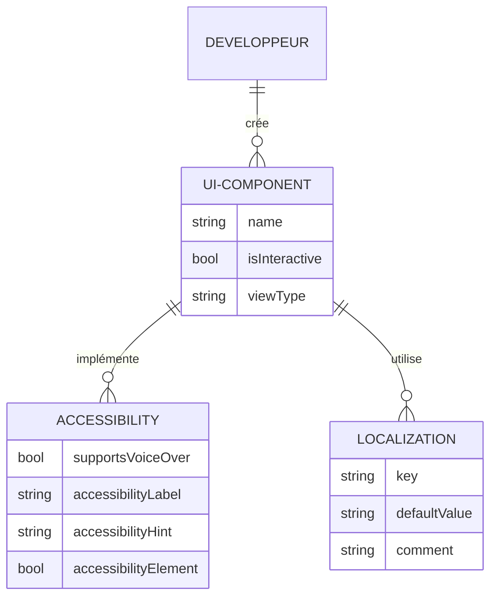

### Style de code

```swift
// Éviter
func proc(a: String, b: Int) -> Bool { return a.count > b }

// Préférer
func processString(_ text: String, withMaxLength maxLength: Int) -> Bool {
    // Vérifie si le texte dépasse la longueur maximale
    return text.count > maxLength
}
```

## 📡 Communication entre modules

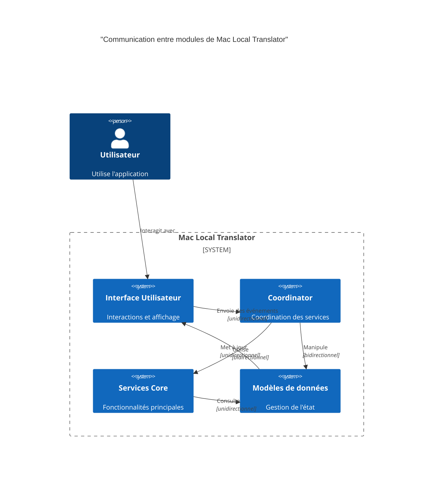

## 🔐 Sécurité et confidentialité

### Points de sécurité à vérifier

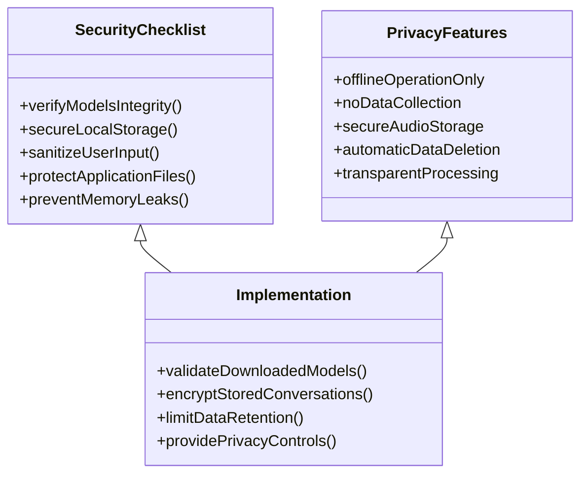

---

<p align="center">
  <b>Restez organisé et suivez ces workflows pour un développement efficace!</b>
</p>